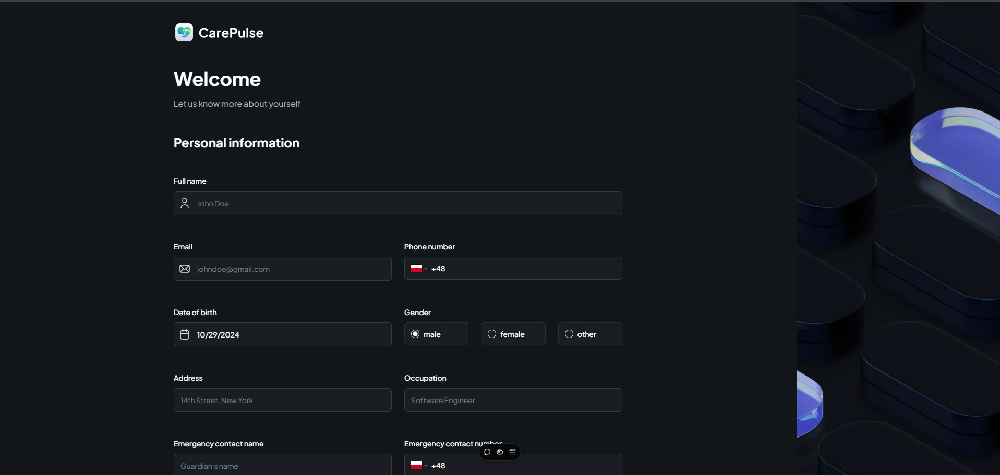
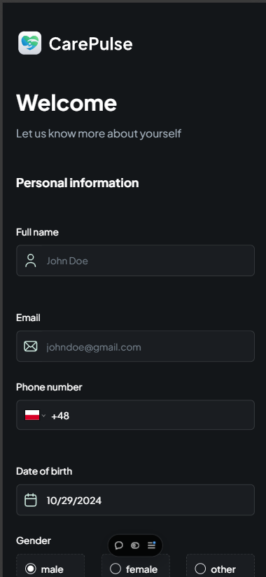
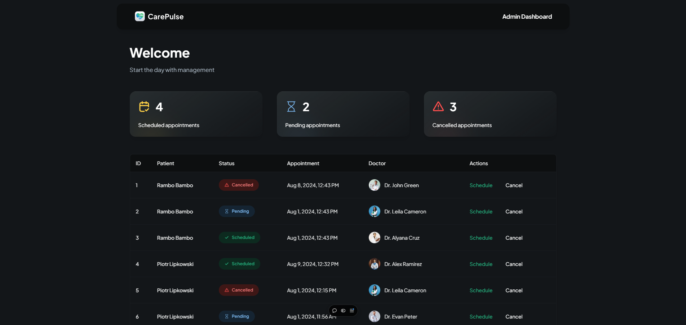
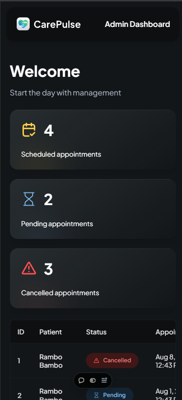

# Wstępne informacje

Aplikacja utworzona na podstawie kursu: https://www.youtube.com/watch?v=lEflo_sc82g

### `Uruchomienie programu za pomocą npm start`

Aplikacja dostępna lokalnie pod adresem [http://localhost:3000](http://localhost:3000)

### Aplikacja dostępna pod adresem: https://carepulse-indol.vercel.app/

### Zrzuty ekranu z aplikacji

